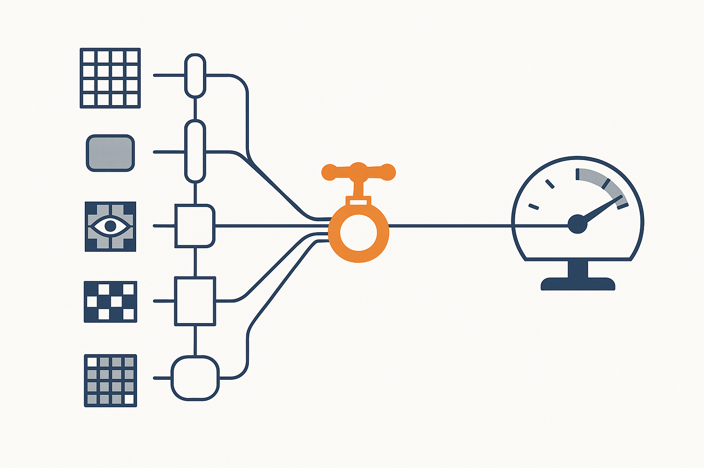
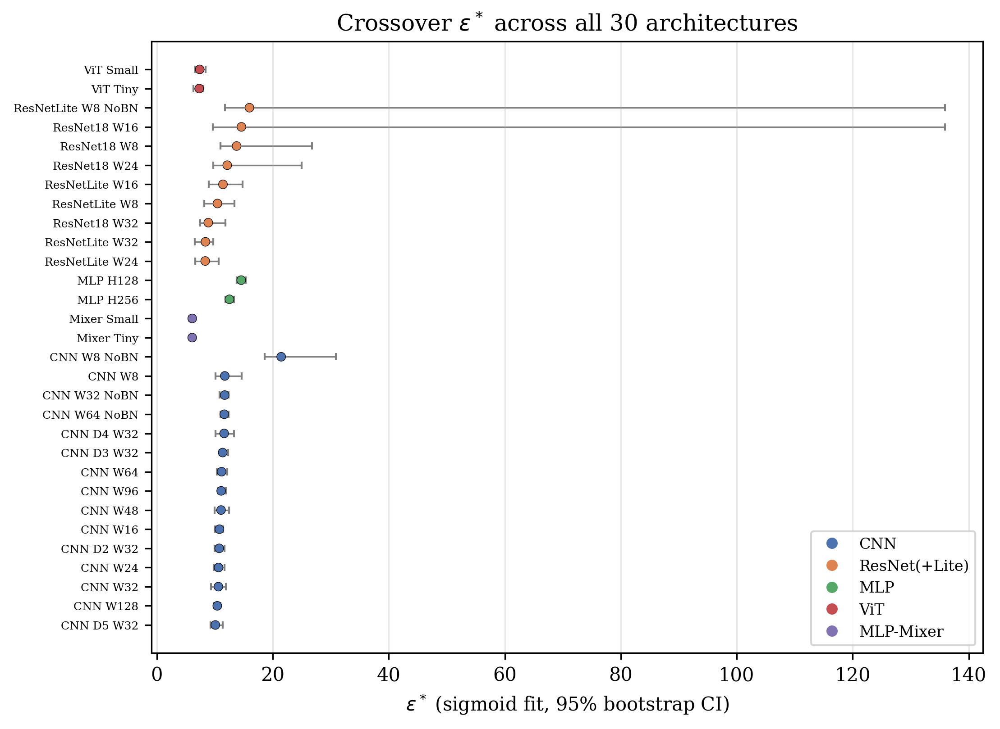

# Self-Stabilizing ML Inference and Functional Trust Regions

<p align="center">
  
</p>

<p align="center">
  <a href="#self-stabilizing-ml-inference"></a>
  <a href="#functional-trust-regions"></a>
  <a href="#the-schedule-confound"></a>
</p>

<p align="center">
  
  
  
  
</p>

---

Two research directions, one question: how do you keep an ML system reliable as conditions change, without losing what it already learned?

**Self-Stabilizing ML Inference (SSMLIS)** addresses this at deployment time: a controller decides, per timestep, whether to run a fast model or a robust one as the input distribution degrades. **Functional Trust Regions (FTR)** addresses it during training: a Lagrangian constraint on output-distribution drift keeps a model from forgetting earlier tasks while it learns new ones.

The FTR line has a second paper layered on top of the first. The original study reported that FTR's critical stability budget, the point where forgetting turns catastrophic, was constant across eight architectures and concluded this reflects task structure. A follow-up diagnostic in this repository found that conclusion was incomplete: the optimizer's own dual-ascent schedule moves that threshold by more than an order of magnitude, more than architecture does. The corrected picture, the diagnostic that found it, and what survives the correction are described below and in [`paper_v2/`](paper_v2/).

---

## Table of Contents

1. [Project Overview](#project-overview)
2. [Self-Stabilizing ML Inference](#self-stabilizing-ml-inference)
   - [Problem Statement](#problem-statement)
   - [System Design](#system-design)
   - [Controller Comparison](#controller-comparison)
   - [Results](#inference-results)
3. [Functional Trust Regions](#functional-trust-regions)
   - [Motivation](#motivation)
   - [Method](#method)
   - [Continual Learning Benchmarks](#continual-learning-benchmarks)
4. [The Schedule Confound](#the-schedule-confound)
5. [Repository Structure](#repository-structure)
6. [Reproducing Experiments](#reproducing-experiments)
7. [Citation](#citation)

---

## Project Overview

Both modules treat stability as a first-class constraint rather than an afterthought, and both were pushed hard enough to find where the original design assumptions broke.

| Module | Problem | Key Contribution |
|--------|---------|-------------------|
| SSMLIS | Runtime reliability under degrading conditions | Multi-objective dual-signal controller with EWMA smoothing and an oscillation-aware dwell timer |
| FTR | Catastrophic forgetting in continual learning | Lagrangian function-space constraint enforced by adaptive dual gradient ascent |
| FTR schedule diagnostic | When and why the FTR stability threshold generalizes | Isolated the dual-ascent schedule as a confound for the reported architecture-independence, then showed what remains true once it is controlled for |

---

## Self-Stabilizing ML Inference

### Problem Statement

Benchmarks assume a fixed environment. Real deployments do not get that. Hardware degrades, network latency spikes, upstream distributions shift. A fast, lightweight model handles nominal conditions fine but breaks under stress. A heavier, more stable model survives the stress but is too slow to run by default.

The obvious fix is to switch to the stable model when the fast one degrades. That creates a different problem: oscillation. A controller that flips between models every few steps produces latency instability worse than either static choice.

This module asks what it takes to make that switching decision well.

### System Design

<p align="center">
  
  <br/><em>The dual-signal controller (green) tracks near-robust reliability through every degradation phase while switching far less often than the simpler strategies it is compared against.</em>
</p>

The system is built around a multi-objective cost function that jointly optimizes three competing objectives:

$$J(\text{model}) = \alpha(1 - R) + \beta L + \gamma P$$

where $R$ is smoothed reliability, $L$ is smoothed latency, and $P$ is the switch penalty from the previous decision. Reliability is measured via variance under perturbation:

$$R = \exp\left(-\lambda \cdot \text{Var}_{x \sim \mathcal{N}(0, \sigma^2)}\left[f(x_0 + x)\right]\right)$$

Both reliability and latency are tracked with an exponential weighted moving average (EWMA, $\alpha = 0.2$), which keeps single-step noise from triggering unnecessary transitions.

**Two models:**
- **FragileModel**: 2-128-2 ReLU network, fast (under 25 microseconds) but sensitive to input noise
- **RobustModel**: 2-64-2 Tanh network, slower, but bounded activations keep it stable under perturbation

**Six controllers**, ranging from static baselines to an online Q-learning agent:

| Controller | Description |
|-----------|-------------|
| `always_fast` | Selects the fast model unconditionally |
| `always_robust` | Selects the robust model unconditionally |
| `threshold_only` | Raw reliability threshold, no smoothing |
| `smoothing_only` | EWMA-smoothed threshold, no cost function |
| `dual_signal` (main) | Full multi-objective controller with a state machine and dwell time |
| `learning` | Online Q-learning with epsilon-greedy exploration |

The `DualSignalController` runs a four-state machine: `STABLE -> DEGRADED -> RECOVERING -> PREEMPTIVE_DEGRADED`. Transitions are governed by both the current cost differential and an oscillation detector: if switches happen too frequently, the dwell timer is extended adaptively to dampen chattering.

**Two degradation environments** test generalization:

- **Structured**: a known four-phase pattern, healthy (noise sigma = 0.01), bursty failures (sigma = 0.3 for 10-step bursts every 100 steps), gradual drift (linear increase from step 200), and adversarial oscillation (sinusoidal, amplitude 0.12, period 20 steps from step 350)
- **Random (unseen)**: a random walk with jumps and resets, never seen during controller design

### Controller Comparison

<p align="center">
  
  <br/><em>Reliability across both environments. The dual-signal controller matches or exceeds the always-robust static baseline while running the faster model for most of the horizon.</em>
</p>

<p align="center">
  
  <br/><em>Model switch oscillation bound, log scale. The Q-learning controller switches roughly 10-13x more often than the dual-signal controller, driven by its 10% epsilon-greedy exploration rate.</em>
</p>

### Inference Results

**Structured degradation environment (default):**

| Controller | Avg Reliability | Oscillation Bound | Stability Horizon |
|-----------|:---:|:---:|:---:|
| Always Fast | 0.9283 | 1 | 499 |
| Always Robust | 0.9589 | 1 | 500 |
| Threshold Only | 0.9290 | 6 | 499 |
| Smoothing Only | 0.9280 | 2 | 499 |
| **Dual-Signal** | **0.9567** | **3** | **499** |
| Q-Learning | 0.9454 | 43 | 499 |

**Random (unseen) environment, out-of-distribution generalization:**

| Controller | Avg Reliability | Oscillation Bound |
|-----------|:---:|:---:|
| Always Fast | 0.9565 | 1 |
| Always Robust | 0.9745 | 1 |
| Threshold Only | 0.9388 | 4 |
| Smoothing Only | 0.9675 | 1 |
| **Dual-Signal** | **0.9763** | **4** |
| Q-Learning | 0.9661 | 40 |

The dual-signal controller reaches the highest reliability on the unseen random environment (0.9763), ahead of the always-robust static baseline, at 4 switches over 500 steps. Outperforming on an environment it was never tuned against suggests the cost function is tracking something structurally real rather than fitting the specific degradation pattern it was designed on.

Other findings:
- EWMA smoothing alone cuts oscillation roughly 3x versus raw thresholding, but still leaves the system exposed to noise spikes without cost-based arbitration.
- The switch penalty ($\gamma = 0.1$) and a 30-step minimum dwell time together account for the low oscillation bound.
- The Q-learning agent's exploration rate ($\epsilon = 0.10$) drives an order of magnitude more oscillation than the dual-signal controller, indicating the dwell timer, not the cost function alone, is what suppresses chattering.

---

## Functional Trust Regions

### Motivation

Neural networks forget. Fine-tune a model on task B and accuracy on task A drops sharply, catastrophic forgetting. Existing approaches split into three camps: regularization methods that penalize weight change (EWC, SI), distillation methods that constrain output behavior (LwF), and replay methods that maintain a buffer of past data.

Regularization methods share an underappreciated flaw: they work in parameter space, a poor proxy for behavioral change. Two weight updates of the same Euclidean magnitude can produce very different output distributions depending on local loss-landscape curvature. A constraint that looks tight in parameter space may permit large output drift; one that looks loose may be overly conservative.

FTR works in function space instead. Rather than constraining $\lVert\theta - \theta_{\text{ref}}\rVert$, it constrains the expected output divergence $D_f(\theta, \theta_{\text{ref}})$ directly.

### Method

<p align="center">
  
  <br/><em>Adaptive Lagrange multiplier dynamics under different epsilon budgets. Tighter budgets drive lambda higher and keep it engaged longer; loose budgets let it decay to zero mid-task, at which point training proceeds as unconstrained fine-tuning for whatever step budget remains.</em>
</p>

**Core optimization problem:**

$$\min_\theta \mathcal{L}_\text{task}(\theta) \quad \text{s.t.} \quad D_f(\theta, \theta_\text{ref}) \leq \varepsilon$$

$$D_f(\theta, \theta_\text{ref}) = \mathbb{E}_x\left[\text{KL}\!\left(\sigma\!\left(\tfrac{f_{\theta_\text{ref}}(x)}{T}\right) \,\Big\|\, \sigma\!\left(\tfrac{f_\theta(x)}{T}\right)\right)\right]$$

Solved with Lagrangian relaxation and dual gradient ascent:

$$\mathcal{L}_\text{total} = \mathcal{L}_\text{task} + \lambda \cdot D_f, \qquad
\lambda_{t+1} = \max\!\left(0,\ \lambda_t + \eta_\lambda \tilde{v}_t\right), \quad \tilde{v}_t = \beta \tilde{v}_{t-1} + (1-\beta)(D_f - \varepsilon)$$

This has three properties parameter-space methods lack:
1. **Adaptive strength.** $\lambda$ rises when forgetting is high and relaxes when the constraint is slack. No manual per-task tuning.
2. **Interpretable budget.** $\varepsilon$ is a concrete behavioral stability contract, not an opaque weight penalty.
3. **A formal guarantee.** For $L$-Lipschitz $f$: $\text{Forgetting}_j \leq L\sqrt{\varepsilon(T-j)}$.

**Default Lagrangian hyperparameters** (fixed across experiments unless stated otherwise): $\lambda_{\text{init}} = 1.0$, dual learning rate $\eta_\lambda = 0.005$, $\lambda_{\max} = 50.0$, momentum $\rho = 0.9$, softmax temperature $T = 2.0$.

### Continual Learning Benchmarks

**Split CIFAR-10** (5 sequential 2-class tasks):

| Method | Avg Accuracy | Backward Transfer | Forgetting |
|--------|:---:|:---:|:---:|
| Vanilla (fine-tuning) | 0.680 &plusmn; 0.004 | -0.245 &plusmn; 0.010 | 0.245 &plusmn; 0.010 |
| Weight Decay | 0.651 &plusmn; 0.003 | -0.252 &plusmn; 0.002 | 0.252 &plusmn; 0.002 |
| EWC | 0.683 &plusmn; 0.012 | -0.240 &plusmn; 0.015 | 0.240 &plusmn; 0.015 |
| SI | 0.685 &plusmn; 0.010 | -0.241 &plusmn; 0.016 | 0.241 &plusmn; 0.016 |
| LwF | 0.771 &plusmn; 0.010 | -0.075 &plusmn; 0.017 | 0.075 &plusmn; 0.017 |
| Fixed Distillation | 0.761 &plusmn; 0.007 | -0.011 &plusmn; 0.004 | 0.011 &plusmn; 0.004 |
| Replay (buffer 500) | 0.791 &plusmn; 0.003 | -0.080 &plusmn; 0.003 | 0.080 &plusmn; 0.003 |
| **FTR** | 0.755 &plusmn; 0.004 | -0.106 &plusmn; 0.007 | 0.106 &plusmn; 0.007 |
| **FTR + Replay** | **0.793 &plusmn; 0.005** | **-0.017 &plusmn; 0.001** | **0.017 &plusmn; 0.001** |

**Split CIFAR-100** (10 sequential 10-class tasks):

| Method | Avg Accuracy | Forgetting |
|--------|:---:|:---:|
| Vanilla | 0.146 &plusmn; 0.008 | 0.449 &plusmn; 0.003 |
| EWC | 0.140 &plusmn; 0.005 | 0.434 &plusmn; 0.026 |
| LwF | 0.188 &plusmn; 0.005 | 0.438 &plusmn; 0.003 |
| **FTR** | 0.178 &plusmn; 0.003 | 0.414 &plusmn; 0.007 |
| **FTR + Replay** | **0.240 &plusmn; 0.004** | **0.176 &plusmn; 0.006** |

Results are averaged over 3 seeds (42, 137, 256). FTR alone is not a state-of-the-art accuracy method here, LwF and plain replay both post competitive numbers, and FTR without replay does not beat LwF on average accuracy in the broader architecture zoo described below either. What FTR contributes is a hard, interpretable, self-tuning constraint that composes cleanly with replay: FTR + Replay is the best method on both benchmarks, and on Split CIFAR-10 it very nearly eliminates backward transfer loss (-0.017).

---

## The Schedule Confound

<p align="center">
  
  <br/><em>The critical stability budget for all 30 architectures in the expanded zoo, schedule held fixed. Vision Transformer and MLP-Mixer sit lower before an epoch-count confound in the zoo's own design is corrected for; corrected, all five families overlap in a single 10.5-13.5 band.</em>
</p>

The original FTR study reported that its critical stability budget, $\varepsilon^*$, the point where forgetting turns catastrophic, was constant across eight architectures and concluded this reflects task structure rather than model geometry. That account turned out to be incomplete.

Because the dual-ascent optimizer resets its Lagrange multiplier at every task boundary, $\varepsilon^*$ is not just a property of the model and the task, it is co-determined by the optimizer's own schedule. Holding architecture and task fixed, changing only the dual learning rate, the initial multiplier, or the per-task step budget moves $\varepsilon^*$ by more than an order of magnitude, a 93x range across six single-factor perturbations on the same model. That is larger than the 2.6x range $\varepsilon^*$ itself spans across 30 architectures with the schedule held fixed.

**What survives the correction:**

- **Architecture-independence is real, conditionally.** Expanding the zoo from 8 to 30 architectures across five representational families (CNN, ResNet, plain MLP, Vision Transformer, MLP-Mixer) and fitting a hierarchical partial-pooling model gives a corrected population-level crossover of $\varepsilon^* = 11.07 \pm 0.25$. Two of the six between-architecture variance sources found in the paper's own zoo were themselves further instances of the schedule confound (Vision Transformer and MLP-Mixer were assigned 5 epochs/task instead of 4); correcting both cuts the model's between-architecture variance by more than half.
- **The three-dimensional schedule sensitivity collapses onto one ratio.** $S = \lambda_{\text{init}} / (\eta_\lambda N)$ absorbs most of the schedule's effect: holding $S$ fixed while independently varying its three components by up to 5x keeps $\varepsilon^*$ within a factor of 2-3, versus the order-of-magnitude range changing any one component alone produces.
- **Curvature still does not predict $\varepsilon^*$**, now on an adequately powered sample. Hessian trace, Fisher trace, spectral norm, and gradient norm remain uncorrelated with $\varepsilon^*$ across all 30 architectures, confirming the original claim on grounds the original $n = 8$ test was underpowered to support.
- **EWC and SI show no phase transition at all.** Their forgetting curves are monotone and smooth; a quadratic parameter-space penalty has no disengagement mechanism, so there is no crossover to locate. LwF, a soft function-space penalty, does show a comparable universal crossover (mean $\alpha^* = 0.73$, CV 32.6% across 15 architectures).
- **A pretrained-backbone sanity check.** Fine-tuning ImageNet-pretrained ViT-B/16 with a LoRA adapter on Split CIFAR-100, FTR gives both the lowest forgetting and the highest average accuracy of four compared methods, and its seed-to-seed forgetting variance is roughly an order of magnitude tighter than the next best method (std 0.001 vs. LwF's 0.018).

The practical upshot is the inverse of what the original study implied: architecture-specific tuning of the stability budget is unnecessary, but the dual-ascent schedule that enforces it is not a free implementation detail. Reporting $\varepsilon^*$ without also reporting $S$, or the schedule that produced it, is not enough to make the number reusable on a different codebase.

The full derivation, the 30-architecture crossover table, the class-incremental and task-ordering robustness checks, and the mechanistic account of why the schedule term dominates are in [`paper_v2/ftr_phase_transition.pdf`](paper_v2/ftr_phase_transition.pdf) (also available as [`.docx`](paper_v2/ftr_phase_transition.docx)). This is a revision of a first version posted to Research Square (DOI 10.21203/rs.3.rs-9205833/v1); the revision is not a resubmission of the same claim, it is a diagnostic of that claim's own reported design.

---

## Repository Structure

```
.
├── src/                                     # Self-Stabilizing Inference System
│   ├── main.py                              # Experiment orchestrator
│   ├── controller/
│   │   ├── dual_controller.py               # DualSignalController (main)
│   │   ├── baseline_controllers.py          # Always-fast/robust, threshold, smoothing
│   │   └── learning_controller.py           # Q-learning controller
│   ├── environment/
│   │   ├── degradation.py                   # Structured degradation (4-phase)
│   │   └── random_degradation.py            # Random walk environment
│   ├── metrics/
│   │   ├── reliability.py                   # Variance-based reliability metric
│   │   ├── latency.py                       # Wall-clock latency tracking
│   │   ├── smoothing.py                     # EWMA smoother
│   │   └── stability.py                     # Formal stability metrics
│   ├── models/
│   │   ├── fragile_model.py                 # Fast ReLU network
│   │   └── robust_model.py                  # Robust Tanh network
│   └── results/                             # Experiment outputs (gitignored)
│
├── stability_constrained_selfimprovement/   # Functional Trust Regions, module code
│   ├── metrics/
│   │   ├── functional_drift.py              # FunctionalDrift + CKA similarity
│   │   └── constrained_optimizer.py         # Lagrangian optimizer, dual ascent
│   ├── models/
│   │   ├── resnet.py                        # SmallResNet family
│   │   ├── transformer.py                   # AlgorithmicTransformer (seq2seq)
│   │   └── rl_agent.py                      # PolicyNetwork + GridWorld
│   ├── experiments/
│   │   ├── exp_continual.py                 # Split CIFAR-10/100, Permuted MNIST
│   │   ├── exp_transformer.py               # Algorithmic reasoning tasks
│   │   └── exp_rl.py                        # Gridworld navigation
│   ├── campaign/                            # 30-architecture zoo pipeline (Kaggle GPU)
│   │   ├── engine.py                        # Training loop shared across all stages
│   │   ├── stages.py                        # diagnostic / crossover / sinvariance / ... stages
│   │   ├── run.py                           # CLI entry point, sharded and resumable
│   │   └── merge.py                         # Combines per-shard JSON into per-stage results
│   ├── run_all.py                           # Local experiment pipeline
│   ├── run_phase_diagram.py                 # Phase transition sweep
│   └── results/                             # Generated JSON outputs (gitignored)
│
├── paper_v2/                                # Current paper: schedule confound revision
│   ├── ftr_phase_transition.tex             # Source
│   ├── ftr_phase_transition.pdf             # Compiled paper
│   ├── ftr_phase_transition.docx            # Word version
│   ├── data/                                # Raw campaign JSON, per stage
│   ├── figures/                             # Paper figures
│   ├── analyze_*.py, gen_*.py               # Analysis and figure-generation scripts
│   └── docx_build/                          # DOCX build pipeline (pandoc + post-processing)
│
├── kaggle_pull/                             # Downloaded Kaggle kernel outputs (raw campaign data)
├── kaggle_upload/                           # Kernel scripts pushed to Kaggle for GPU runs
├── paper_data/                              # Curated artifacts used for v1 figures
├── figures/                                 # v1 / SSMLIS figures used in this README
└── self_stabilizing_inference/              # Legacy Keras/TF prototype
```

---

## Reproducing Experiments

### Self-Stabilizing Inference

```bash
cd src
pip install -r ../requirements.txt

# Run all 6 controllers x 2 environments (12 configurations)
python main.py

# Results are written to src/results/metrics/ and src/results/logs/ (gitignored)
```

### Functional Trust Regions, local runs

```bash
cd stability_constrained_selfimprovement
pip install -r requirements.txt

# Quick test: 1 seed, reduced epochs
python run_all.py --quick

# Full pipeline: 5 seeds, all benchmarks
python run_all.py

# Phase transition sweep only
python run_phase_diagram.py

# Reproduce a specific experiment
python run_all.py --experiment continual_cifar --seeds 42 137 256
```

### FTR architecture-zoo campaign (paper_v2)

The 30-architecture diagnostic behind `paper_v2/` was run on free-tier Kaggle GPUs (Tesla P100 and T4x2) across several dozen kernel sessions, more than 11,300 individual training runs in total. The pipeline is sharded and checkpointed so it can be resumed across sessions:

```bash
cd stability_constrained_selfimprovement

python -m campaign.run --stage diagnostic --device cuda:0 \
    --shard-id 0 --num-shards 2 --time-budget-hours 3.0 \
    --state-dir ./state --out-dir ./state

# After all shards for a stage finish, merge them:
python -m campaign.merge
```

Available stages include `diagnostic` (schedule single-factor sweep), `crossover` (dense architecture-zoo sweep), `sinvariance`, `pretrained`, and the robustness checks (task ordering, class-incremental, KL direction, granularity). The analysis and figure scripts in `paper_v2/` (`analyze_*.py`, `gen_*.py`) consume the merged JSON in `paper_v2/data/`.

### Regenerating README Figures

```bash
pip install -r requirements.txt
python generate_figures.py
```

**Hardware.** The SSMLIS and single-architecture FTR experiments run on CPU in minutes. The full FTR campaign (30 architectures x multiple seeds x multiple stages) needs a GPU; it was built for, and tested against, Kaggle's free-tier session limits.

---

## Key Design Decisions

**Function-space constraints instead of parameter-space.** Parameter distance is a poor proxy for behavioral change when the loss landscape is curved. Two weight vectors equidistant from a reference point can produce very different output distributions. Constraining $D_f$ directly makes the constraint invariant to reparametrization and accounts for local curvature automatically.

**EWMA over raw signals for controller decisions.** Single-step reliability measurements are noisy by construction (computed over 10 perturbed samples). Raw signals produce oscillation. EWMA with $\alpha = 0.2$ smooths transient spikes while still tracking genuine degradation trends within a few dozen steps.

**A dwell timer, not just a switch penalty.** The switch penalty $\gamma$ reduces switching frequency but fails once the cost differential is large enough to overcome it. The dwell timer enforces a hard minimum residence time (30 steps) that prevents oscillation even when the cost signal strongly favors switching.

**Report the schedule, not just the budget.** A reported $\varepsilon^*$ is not portable across codebases on its own. The dual-ascent schedule ($\eta_\lambda$, $\lambda_{\text{init}}$, steps per task) that produced it moves the number by more than an order of magnitude on its own; reporting $S = \lambda_{\text{init}}/(\eta_\lambda N)$ alongside $\varepsilon^*$ recovers most of the portability that architecture-only reporting implied but did not deliver.

---

## Citation

If you use this work, please cite the current revision:

```bibtex
@misc{ftr2026schedule,
  title  = {Functional Trust Regions (FTR): A Lagrangian Framework for
            Stability-Constrained Continual Learning},
  author = {Bhand, Kavya and Joshi, Aadi and Rathod, Vijay},
  year   = {2026},
  note   = {Preprint, under review. Revises Research Square preprint
            DOI 10.21203/rs.3.rs-9205833/v1.},
  url    = {https://github.com/aadi-joshi/Self-Stabilizing-ML-Inference}
}
```

---

## License

MIT License. See [LICENSE](LICENSE) for details.
