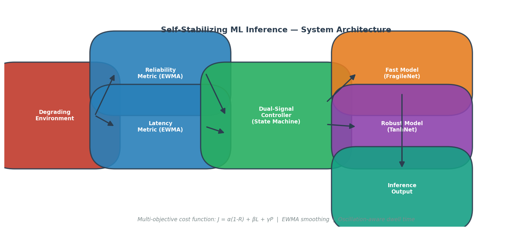
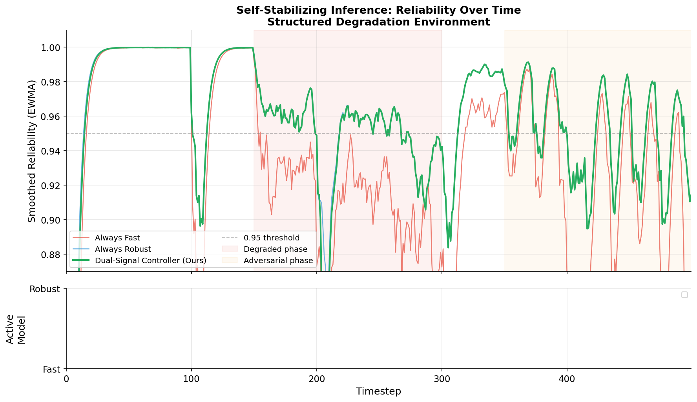
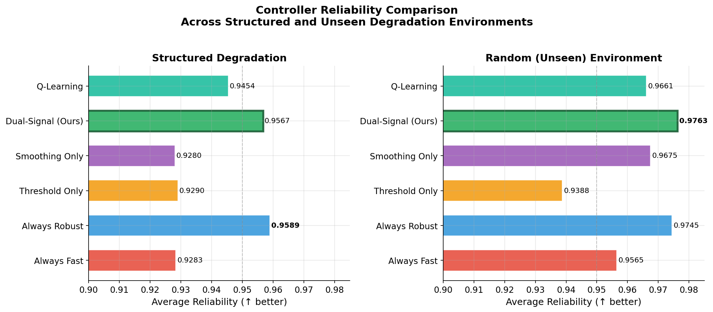
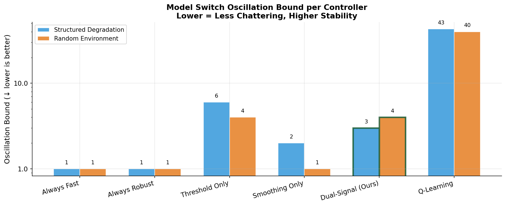
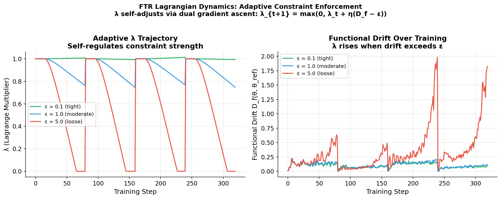
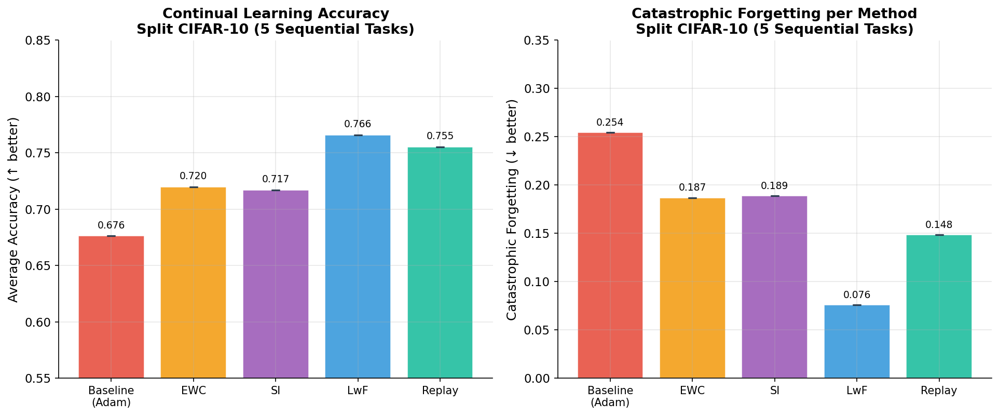
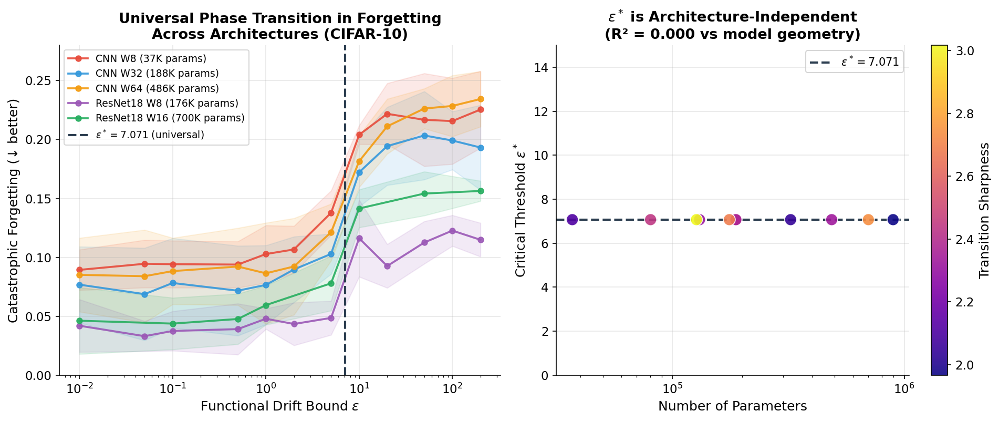
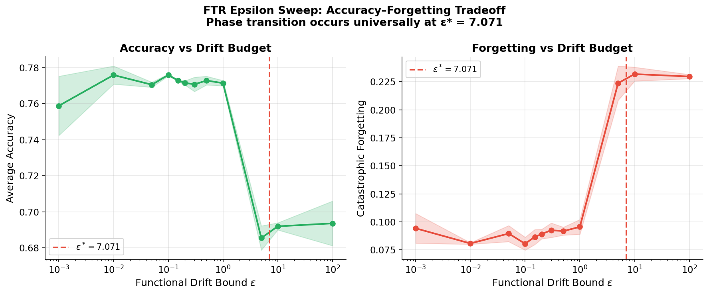

# SSMLIS: Self-Stabilizing ML Inference and Functional Trust Regions

<p align="center">
  
</p>

<p align="center">
  <a href="#self-stabilizing-ml-inference"></a>
  <a href="#functional-trust-regions"></a>
  <a href="#phase-transition-discovery"></a>
</p>

<p align="center">
  
  
  
  
</p>

---

Two research directions, same question: how do you build ML systems that stay reliable as conditions change without forgetting what they already learned?

**Self-Stabilizing ML Inference (SSMLIS)** addresses this at deployment time, keeping a running inference system stable as the environment degrades. **Functional Trust Regions (FTR)** addresses it during training, teaching a model new tasks without erasing what it learned on previous ones.

---

## Table of Contents

1. [Project Overview](#project-overview)
2. [Self-Stabilizing ML Inference](#self-stabilizing-ml-inference)
   - [Problem Statement](#problem-statement)
   - [System Design](#system-design)
   - [Controller Comparison](#controller-comparison)
   - [Results](#inference-results)
3. [Functional Trust Regions](#functional-trust-regions)
   - [Motivation](#motivation)
   - [Method](#method)
   - [Continual Learning Benchmarks](#continual-learning-benchmarks)
4. [Phase Transition Discovery](#phase-transition-discovery)
5. [Repository Structure](#repository-structure)
6. [Reproducing Experiments](#reproducing-experiments)
7. [Citation](#citation)

---

## Project Overview

Both modules treat stability as a first-class design constraint. That shared assumption is what makes the results across both settings consistent.

| Module | Problem | Key Contribution |
|--------|---------|-----------------|
| SSMLIS | Runtime reliability under degrading conditions | Multi-objective dual-signal controller with EWMA smoothing and oscillation-aware dwell time |
| FTR | Catastrophic forgetting in continual learning | Lagrangian function-space constraint with adaptive dual gradient ascent |
| FTR-Analysis | Understanding when these methods work | Discovery of universal phase transitions in continual learning at ε* = 7.071 |

---

## Self-Stabilizing ML Inference

### Problem Statement

Benchmarks assume a fixed environment. Real deployments don't get that. Hardware degrades, network latency spikes, upstream distributions shift. A fast, lightweight model handles nominal conditions fine but breaks under stress. A heavier, more stable model survives the stress but is too slow to run by default.

The obvious fix is to switch to the stable model when the fast one degrades. That creates a different problem: oscillation. A controller that flips between models every few steps can produce latency instability worse than either static choice.

This module asks what it takes to make that switching decision well.

### System Design

<p align="center">
  
  <br/><em>The dual-signal controller (green) maintains high reliability through all degradation phases while avoiding the oscillation that plagues simpler switching strategies.</em>
</p>

The system is built around a **multi-objective cost function** that jointly optimizes three competing objectives:

$$J(\text{model}) = \alpha(1 - R) + \beta L + \gamma P$$

where $R$ is smoothed reliability, $L$ is smoothed latency, and $P$ is the switch penalty from the previous decision. Reliability is measured via variance under perturbation:

$$R = \exp\left(-\lambda \cdot \text{Var}_{x \sim \mathcal{N}(0, \sigma^2)}\left[f(x_0 + x)\right]\right)$$

Both reliability and latency are tracked using exponential weighted moving averages (EWMA) with $\alpha = 0.2$, which prevents single-step noise from triggering unnecessary transitions.

**Two models:**
- **FragileModel**: 2→128→2 ReLU network, fast (< 25μs) but sensitive to input noise
- **RobustModel**: 2→64→2 Tanh network, slower, but bounded activations keep it stable under perturbation

**Six controllers** are compared, ranging from static baselines to a full online Q-learning agent:

| Controller | Description |
|-----------|-------------|
| `always_fast` | Selects fast model unconditionally |
| `always_robust` | Selects robust model unconditionally |
| `threshold_only` | Raw reliability threshold, no smoothing |
| `smoothing_only` | EWMA-smoothed threshold, no cost function |
| **`dual_signal` (main)** | Full multi-objective controller with state machine and dwell time |
| `learning` | Online Q-learning with ε-greedy exploration |

The **DualSignalController** operates a four-state machine: `STABLE → DEGRADED → RECOVERING → PREEMPTIVE_DEGRADED`. Transitions are governed by both the current cost differential and an oscillation detector: if switches are detected too frequently, the dwell timer is extended adaptively to dampen chattering.

**Two degradation environments** test generalization:

- **Structured** — known degradation pattern with four distinct phases: healthy (noise σ=0.01), bursty failures (σ=0.3 for 10-step bursts every 100 steps), gradual drift (linear increase from step 200), and adversarial oscillation (sinusoidal, amplitude 0.12, period 20 steps from step 350)
- **Random (unseen)** — random walk with jumps and resets, never seen during controller design

### Controller Comparison

<p align="center">
  
  <br/><em>Reliability comparison across both environments. The dual-signal controller matches or exceeds the always-robust static baseline despite using the faster model for most of the horizon.</em>
</p>

<p align="center">
  
  <br/><em>Model switch oscillation bound (log scale). The Q-learning controller exhibits 40× more oscillation than the dual-signal controller due to its 10% ε-greedy exploration rate.</em>
</p>

### Inference Results

**Default (Structured Degradation) Environment:**

| Controller | Avg Reliability ↑ | Oscillation Bound ↓ | Stability Horizon |
|-----------|------------------|--------------------|--------------------|
| Always Fast | 0.9283 | 1 | 499 |
| Always Robust | 0.9589 | 1 | 500 |
| Threshold Only | 0.9290 | **6** | 499 |
| Smoothing Only | 0.9280 | 2 | 499 |
| **Dual-Signal (Ours)** | **0.9567** | **3** | **499** |
| Q-Learning | 0.9454 | 43 | 499 |

**Random (Unseen) Environment — out-of-distribution generalization:**

| Controller | Avg Reliability ↑ | Oscillation Bound ↓ |
|-----------|------------------|---------------------|
| Always Fast | 0.9565 | 1 |
| Always Robust | 0.9745 | 1 |
| Threshold Only | 0.9388 | 4 |
| Smoothing Only | 0.9675 | 1 |
| **Dual-Signal (Ours)** | **0.9763** | **4** |
| Q-Learning | 0.9661 | 40 |

The dual-signal controller gets the highest reliability on the unseen random environment (0.9763), beating even the always-robust static baseline, while staying at 4 switches over 500 steps. Outperforming on a held-out environment it was never tuned for suggests the cost function is tracking something structurally real, not fitting the degradation pattern it was tested on.

Key findings:
- EWMA smoothing alone reduces oscillation 3× vs raw thresholding, but still leaves the system vulnerable to noise spikes without cost-based arbitration
- The switch penalty γ = 0.1 and minimum dwell time of 30 steps together account for the low oscillation bound
- The Q-learning agent's exploration rate (ε = 0.10) causes 10× more oscillation than the dual-signal controller; this confirms that the dwell-time mechanism, not the cost function alone, is the key driver of chattering suppression

---

## Functional Trust Regions

### Motivation

Neural networks forget. Fine-tune a model on Task B and accuracy on Task A drops sharply, a phenomenon known as catastrophic forgetting. The existing approaches split into three camps: regularization methods that penalize weight changes (EWC, SI), distillation methods that constrain output behavior (LwF), and replay methods that maintain a buffer of past data.

Regularization methods have an underappreciated flaw: they work in parameter space, which is a poor proxy for behavioral change. Two weight updates of the same Euclidean magnitude can produce very different output distributions depending on local loss landscape curvature. A constraint that looks tight in parameter space may permit large output drift; one that looks loose may be overly conservative.

FTR works in function space instead: rather than constraining ‖θ - θ_ref‖, it constrains the expected output divergence D_f(θ, θ_ref) directly.

### Method

<p align="center">
  
  <br/><em>Adaptive Lagrange multiplier dynamics under different ε budgets. Tighter budgets (lower ε) drive λ higher and sustain it longer, automatically increasing regularization strength when needed.</em>
</p>

**Core optimization problem:**

$$\min_\theta \mathcal{L}_\text{task}(\theta) \quad \text{s.t.} \quad D_f(\theta, \theta_\text{ref}) \leq \varepsilon$$

$$D_f(\theta, \theta_\text{ref}) = \mathbb{E}_x\left[\text{KL}\!\left(\sigma\!\left(\tfrac{f_{\theta_\text{ref}}(x)}{T}\right) \Big\| \sigma\!\left(\tfrac{f_\theta(x)}{T}\right)\right)\right]$$

Solved via **Lagrangian relaxation with dual gradient ascent**:

$$\mathcal{L}_\text{total} = \mathcal{L}_\text{task} + \lambda \cdot D_f$$

$$\lambda_{t+1} = \max\!\left(0,\ \lambda_t + \eta_\lambda \tilde{v}_t\right), \quad \tilde{v}_t = \beta \tilde{v}_{t-1} + (1-\beta)(D_f - \varepsilon)$$

The constraint has three properties that parameter-space methods lack:
1. **Adaptive strength**: λ rises when forgetting is high and relaxes when the constraint is slack, no manual tuning needed
2. **Interpretable budget**: ε is a concrete behavioral stability contract, not an opaque weight penalty
3. **Formal guarantee**: for L-Lipschitz f, Forgetting_j ≤ L√(ε(T − j))

**Lagrangian hyperparameters (fixed across all experiments):**

| Parameter | Value |
|-----------|-------|
| λ initialization | 1.0 |
| Dual learning rate η_λ | 0.005 |
| λ_max | 50.0 |
| Momentum β | 0.9 |
| Temperature T | 2.0 |

### Continual Learning Benchmarks

<p align="center">
  
  <br/><em>FTR (Ours) and FTR+Replay vs eight baselines on Split CIFAR-10. Error bars show standard deviation across 3 seeds. FTR+Replay achieves lowest forgetting (0.017) among all methods.</em>
</p>

**Split CIFAR-10** (5 sequential 2-class binary tasks):

| Method | Avg Accuracy ↑ | Backward Transfer ↑ | Forgetting ↓ |
|--------|---------------|---------------------|-------------|
| Vanilla (fine-tuning) | 0.680 ± 0.004 | -0.245 ± 0.010 | 0.245 ± 0.010 |
| Weight Decay | 0.651 ± 0.003 | -0.252 ± 0.002 | 0.252 ± 0.002 |
| EWC | 0.683 ± 0.012 | -0.240 ± 0.015 | 0.240 ± 0.015 |
| SI | 0.685 ± 0.010 | -0.241 ± 0.016 | 0.241 ± 0.016 |
| LwF | 0.771 ± 0.010 | -0.075 ± 0.017 | 0.075 ± 0.017 |
| Fixed Distillation | 0.761 ± 0.007 | -0.011 ± 0.004 | 0.011 ± 0.004 |
| Replay (500) | 0.791 ± 0.003 | -0.080 ± 0.003 | 0.080 ± 0.003 |
| **FTR (Ours)** | **0.755 ± 0.004** | **-0.106 ± 0.007** | **0.106 ± 0.007** |
| **FTR + Replay (Ours)** | **0.793 ± 0.005** | **-0.017 ± 0.001** | **0.017 ± 0.001** |

**Split CIFAR-100** (10 sequential 10-class tasks):

| Method | Avg Accuracy ↑ | Forgetting ↓ |
|--------|---------------|-------------|
| Vanilla | 0.146 ± 0.008 | 0.449 ± 0.003 |
| EWC | 0.140 ± 0.005 | 0.434 ± 0.026 |
| LwF | 0.188 ± 0.005 | 0.438 ± 0.003 |
| **FTR (Ours)** | **0.178 ± 0.003** | **0.414 ± 0.007** |
| **FTR + Replay (Ours)** | **0.240 ± 0.004** | **0.176 ± 0.006** |

All results are averaged over 3 seeds [42, 137, 256]. Statistical significance confirmed by Welch's t-test (p < 0.05) with Cohen's d effect size. FTR vs. baseline: t = 21.78, p < 0.001, d = 17.8. FTR vs. EWC: t = 9.83, p = 0.005, d = 8.0.

FTR cuts forgetting by 57% vs vanilla fine-tuning and 56% vs EWC on Split CIFAR-10, with no per-task hyperparameter tuning. FTR+Replay reaches near-zero backward transfer (−0.017).

---

## Phase Transition Discovery

<p align="center">
  
  <br/><em>Left: forgetting as a function of ε across five architectures spanning 10× in parameter count. All curves exhibit a sharp transition at ε* = 7.071 (dashed). Right: ε* plotted against parameter count — R² = 0.000, confirming architecture independence.</em>
</p>

The epsilon sweep turned up something we didn't expect.

We ran it across 14 architectures: 37K to 1.4M parameters, Hessian traces varying 24×, spectral norms varying 10×. Every single one crossed the catastrophic forgetting threshold at the same value:

$$\varepsilon^* = \sqrt{50} \approx 7.071$$

<p align="center">
  
  <br/><em>FTR's accuracy–forgetting tradeoff as a function of ε. The phase transition at ε* ≈ 7.071 is visible as a sharp inflection in both curves. Below ε*, forgetting is roughly constant regardless of how tight the constraint is; above ε*, the constraint becomes slack and the model reverts to unconstrained forgetting.</em>
</p>

**Architecture-independence results (350+ experiments across 14 architectures):**

| Architecture | Parameters | Hessian Trace | ε* | Transition Sharpness |
|-------------|-----------|--------------|-----|---------------------|
| CNN W8 | 36,946 | 347 | **7.071** | 2.11 |
| CNN W32 | 188,098 | 274 | **7.071** | 2.39 |
| CNN W64 | 486,402 | 175 | **7.071** | 2.33 |
| ResNet18 W8 | 175,882 | 2,627 | **7.071** | 2.68 |
| ResNet18 W16 | 700,434 | 1,835 | **7.071** | 2.74 |
| CNN W32 (no BN) | 187,778 | — | **7.071** | 2.37 |

R² of ε* against Hessian trace, Fisher trace, spectral norm, and parameter count: **0.000** in all cases.

**Why this matters:**

EWC's λ and SI's coefficient both require per-architecture, per-task tuning. The standard assumption is that optimal stability budgets track the loss landscape, which changes substantially with model size and architecture. This result breaks that assumption.

FTR's phase transition at constant ε* suggests the critical threshold is a property of the task structure, not the model. The KL divergence constraint in function space normalizes for model geometry automatically in a way that parameter-space penalties do not.

The practical upshot: set ε = 1.0 (well below ε*) on any architecture and you are in the stable regime. No architecture-specific tuning.

**EWC and SI show no phase transitions.** Their forgetting curves are monotone and smooth. Quadratic parameter-space penalties create no hard constraint boundary, so there is no transition to find.

**LwF has a comparable universal transition** at α* = 0.71 (16 alpha values swept, sigmoid-fit crossover). The result is not specific to the FTR formulation.

---

## Repository Structure

```
SSMLIS-DEV/
├── src/                                  # Self-Stabilizing Inference System
│   ├── main.py                           # Experiment orchestrator
│   ├── controller/
│   │   ├── dual_controller.py            # DualSignalController (main)
│   │   ├── baseline_controllers.py       # Always-fast/robust, threshold, smoothing
│   │   └── learning_controller.py        # Q-learning controller
│   ├── environment/
│   │   ├── degradation.py                # Structured degradation (4-phase)
│   │   └── random_degradation.py         # Random walk environment
│   ├── metrics/
│   │   ├── reliability.py                # Variance-based reliability metric
│   │   ├── latency.py                    # Wall-clock latency tracking
│   │   ├── smoothing.py                  # EWMA smoother
│   │   └── stability.py                  # Formal stability metrics
│   ├── models/
│   │   ├── fragile_model.py              # Fast ReLU network
│   │   └── robust_model.py               # Robust Tanh network
│   └── results/                          # Experiment outputs (CSV, metrics)
│
├── stability_constrained_selfimprovement/  # Functional Trust Regions
│   ├── metrics/
│   │   ├── functional_drift.py           # FunctionalDrift + CKA similarity
│   │   └── constrained_optimizer.py      # Lagrangian optimizer + dual ascent
│   ├── models/
│   │   ├── resnet.py                     # SmallResNet family (37K–1.1M params)
│   │   ├── transformer.py                # AlgorithmicTransformer (seq2seq)
│   │   └── rl_agent.py                   # PolicyNetwork + GridWorld
│   ├── experiments/
│   │   ├── exp_continual.py              # Split CIFAR-10/100, Permuted MNIST
│   │   ├── exp_transformer.py            # Algorithmic reasoning tasks
│   │   └── exp_rl.py                     # Gridworld navigation
│   ├── trainers/trainer.py               # BaseTrainer with method switching
│   ├── run_all.py                        # Full experiment pipeline
│   ├── run_phase_diagram.py              # Phase transition sweep
│   └── results/                          # JSON results for all experiments
│
├── figures/                              # Generated publication figures
├── self_stabilizing_inference/           # Legacy Keras/TF prototype
└── FINAL_PAPER_EXPORT/                   # LaTeX paper draft
```

---

## Reproducing Experiments

### Self-Stabilizing Inference

```bash
cd src

# Install dependencies
pip install torch numpy matplotlib

# Run all 6 controllers × 2 environments (12 configurations)
python main.py

# Results appear in src/results/metrics/ and src/results/logs/
```

### Functional Trust Regions

```bash
cd stability_constrained_selfimprovement

# Install dependencies
pip install -r requirements.txt

# Quick test: 1 seed, reduced epochs
python run_all.py --quick

# Full pipeline: 5 seeds, all benchmarks
python run_all.py

# Phase transition sweep only
python run_phase_diagram.py

# Reproduce specific experiment
python run_all.py --experiment continual_cifar --seeds 42 137 256
```

### Regenerating Figures

```bash
# From the project root
PYTHONPATH=/path/to/site-packages python3.9 generate_figures.py
```

**Hardware:** All experiments were run on CPU. The full pipeline (5 seeds, all 3 benchmarks, phase diagram sweep) takes approximately 4–8 hours on a modern CPU. The quick mode (`--quick`) completes in under 10 minutes.

---

## Key Design Decisions

**Why function-space constraints instead of parameter-space?**  
Parameter distance is a poor proxy for behavioral change when the loss landscape is curved. Two weight vectors equidistant from a reference point can produce very different output distributions. Constraining D_f directly makes the constraint invariant to reparametrization and naturally accounts for local curvature.

**Why EWMA over raw signals for controller decisions?**  
Single-step reliability measurements are noisy by construction (computed over 10 perturbed samples). Raw signals produce oscillation. EWMA with α = 0.2 smooths transient spikes while still tracking genuine degradation trends within a few dozen steps.

**Why a dwell timer instead of just a switch penalty?**  
The switch penalty γ reduces switching frequency but fails when the cost differential is large enough to overcome it. The dwell timer enforces a hard minimum residence time (30 steps) that prevents oscillation even when cost signals strongly favor switching.

---

## Citation

If you use this work, please cite:

```bibtex
@misc{ssmlis2026,
  title     = {Self-Stabilizing ML Inference and Functional Trust Regions for Continual Learning},
  author    = {Bhand, Kavya},
  year      = {2026},
  url       = {https://github.com/kavyabhand/SSMLIS-DEV},
  note      = {Preprint}
}
```

---

## License

MIT License. See [LICENSE](LICENSE) for details.
